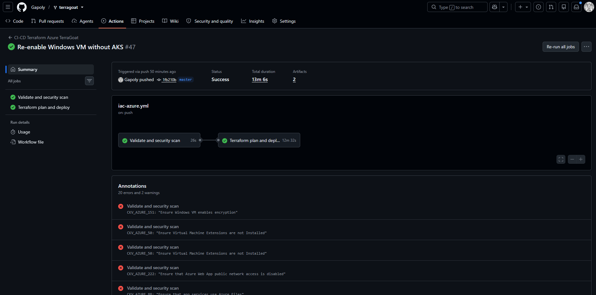
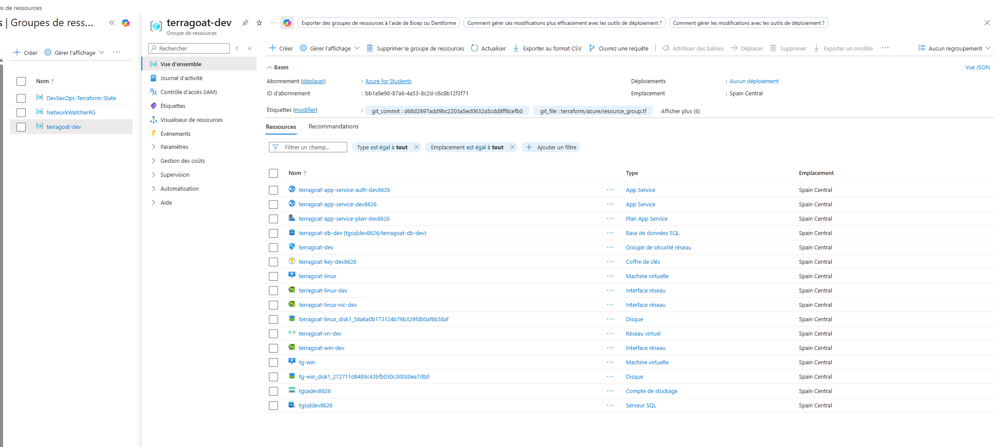

# DevSecOps - Terragoat

## Membres :

- **SKOVGAARD Norman** - *M1 Infra*
- **VAZQUEZ Angelo** - *M1 Infra*

## Sujet : Terragoat
- Mettre en place une chaîne CI/CD permettant d'analyser, sécuriser et déployer automatiquement une infrastructure Cloud décrite en infrastructure as Code
- Utiliser la version 0.12 de terraform ou mettre à jour le code de TerraGoat
- Automatiser l'analyse de sécurité de l'Infrastructure as Code
- Identifier les mauvaises configurations de sécurité présentes dans l'infrastructure
- Corriger les vulnérabilités les plus critiques
- Générer et conserver les rapports d'analyse
- Documenter les risques identifiés, les corrections apportées et les bonnes pratiques mises en œuvre

## Notre workflow

## 1. Préparation de la machine

Nous installons une machine Debian 13 avec les outils nécessaire :

```bash
sudo apt update
# Packages apt à installer
sudo apt install -y git curl gpg pipx
# Installation Checkov
pipx install checkov
```

Installation de Terraform :

```bash
wget -O - https://apt.releases.hashicorp.com/gpg | sudo gpg --dearmor -o /usr/share/keyrings/hashicorp-archive-keyring.gpg

echo "deb [arch=$(dpkg --print-architecture) signed-by=/usr/share/keyrings/hashicorp-archive-keyring.gpg] https://apt.releases.hashicorp.com bookworm main" | sudo tee /etc/apt/sources.list.d/hashicorp.list

sudo apt update && sudo apt install terraform
```

Vérification :

```bash
terraform version
```

---

## 2. Création du dépôt Git

Création du fork :

- Fork de https://github.com/bridgecrewio/terragoat vers https://github.com/Gapoly/terragoat

Clonage du fork :
```bash
git clone https://github.com/Gapoly/terragoat
```

## 3. Analyse

- Analyse `checkov` du dossier `terragoat/terraform/azure`
- Test du code Terraform/Azure avec `terraform validate`

```bash
checkov -d ~/terragoat/terraform/azure --framework terraform -o cli > checkov_result.txt
```

**Tableau récapitulatif des risques**

| Fichier               | Ressource    |                            Risque | Criticité | Correction                            |
| --------------------- | ------------ | --------------------------------: | --------: | ------------------------------------- |
| `networking.tf`       | NSG          |        SSH/RDP ouverts à Internet |  Critique | Restreindre à une IP d’administration |
| `instance.tf`         | VM Linux     | Authentification par mot de passe |  Critique | Utiliser une clé SSH                  |
| `sql.tf` / `mssql.tf` | SQL          |        Mots de passe codés en dur |  Critique | Utiliser des variables sensibles      |
| `storage.tf`          | Managed Disk |             Chiffrement désactivé |    Élevée | Activer le chiffrement                |
| `app_service.tf`      | App Service  |             HTTPS non obligatoire |    Élevée | Activer `https_only`                  |
| `app_service.tf`      | App Service  |                           TLS 1.1 |    Élevée | Utiliser TLS 1.2 minimum              |
| `aks.tf`              | AKS          |                    RBAC désactivé |  Critique | Activer RBAC                          |
| `aks.tf`              | AKS          |       Dashboard Kubernetes activé |    Élevée | Désactiver le dashboard               |
| `networking.tf`       | Flow logs    |            Logs réseau désactivés |   Moyenne | Activer les flow logs                 |
| `security_center.tf`  | Defender     |               Alertes désactivées |   Moyenne | Activer les notificat
---

| Type de problème                    | Risque                           | Correction attendue                                     |
| ----------------------------------- | -------------------------------- | ------------------------------------------------------- |
| Bucket S3 public                    | Exposition de données            | Bloquer l’accès public, retirer les ACL publiques       |
| Security Group ouvert à `0.0.0.0/0` | Accès SSH/RDP public             | Restreindre l’IP source ou supprimer l’exposition       |
| Base RDS publique                   | Exposition de base de données    | `publicly_accessible = false`                           |
| Chiffrement désactivé               | Données lisibles en cas de fuite | Activer encryption at rest                              |
| Secrets hardcodés                   | Fuite d’identifiants             | Utiliser GitHub Secrets, variables CI ou secret manager |
| IAM trop permissif                  | Escalade de privilèges           | Appliquer le principe du moindre privilège              |
---

## 4. Github CI

- Mise en place de la pipeline Github CI avec `.github/workflow/iac-azure.yml`

## 5. Correction du code Terraform

### Tableau récapitulatif des corrections validées

| Problème identifié dans la version initiale     | Checkov                         | Fichier concerné      | État initial                       | État final                  | Corrigé |
| ----------------------------------------------- | ------------------------------- | --------------------- | ---------------------------------- | --------------------------- | ------- |
| RBAC désactivé sur AKS                          | `CKV_AZURE_5`                   | `aks.tf`              | Failed                             | Passed                      | Oui     |
| Logs Azure Monitor AKS désactivés               | `CKV_AZURE_4`                   | `aks.tf`              | Failed                             | Passed                      | Oui     |
| Kubernetes Dashboard activé                     | `CKV_AZURE_8`                   | `aks.tf`              | Failed                             | Passed                      | Oui     |
| App Service 1 sans redirection HTTPS            | `CKV_AZURE_14`                  | `app_service.tf`      | Failed                             | Passed                      | Oui     |
| App Service 1 avec TLS trop faible              | `CKV_AZURE_15`                  | `app_service.tf`      | Failed                             | Passed                      | Oui     |
| App Service 1 sans authentification             | `CKV_AZURE_13`                  | `app_service.tf`      | Failed                             | Passed                      | Oui     |
| App Service 2 sans authentification             | `CKV_AZURE_13`                  | `app_service.tf`      | Failed                             | Passed                      | Oui     |
| VM Linux avec authentification basique          | `CKV_AZURE_1`                   | `instance.tf`         | Failed                             | Passed                      | Oui     |
| VM Linux avec authentification par mot de passe | `CKV_AZURE_149`                 | `instance.tf`         | Failed                             | Passed                      | Oui     |
| VM Linux sans SSH par clé                       | `CKV_AZURE_178`                 | `instance.tf`         | Failed                             | Passed                      | Oui     |
| SSH ouvert à Internet                           | `CKV_AZURE_10`                  | `networking.tf`       | Failed                             | Passed                      | Oui     |
| RDP ouvert à Internet                           | `CKV_AZURE_9`                   | `networking.tf`       | Failed                             | Passed                      | Oui     |
| Flow logs NSG absents ou insuffisants           | `CKV_AZURE_12`                  | `networking.tf`       | Failed                             | Passed                      | Oui     |
| Disque managé non chiffré                       | `CKV_AZURE_2`                   | `storage.tf`          | Failed                             | Passed                      | Oui     |
| Storage Account sans TLS récent                 | `CKV_AZURE_44`                  | `storage.tf`          | Failed                             | Passed                      | Oui     |
| Logging Queue Storage désactivé                 | `CKV_AZURE_33`                  | `storage.tf`          | Failed                             | Passed                      | Oui     |
| Accès public aux blobs non restreint            | `CKV_AZURE_190`                 | `storage.tf`          | Failed                             | Passed                      | Oui     |
| Accès anonyme aux blobs autorisé                | `CKV2_AZURE_47`                 | `storage.tf`          | Failed                             | Passed                      | Oui     |
| Shared Key Authorization autorisé               | `CKV2_AZURE_40`                 | `storage.tf`          | Failed                             | Passed                      | Oui     |
| Politique d’expiration SAS absente              | `CKV2_AZURE_41`                 | `storage.tf`          | Failed                             | Passed                      | Oui     |
| Azure Security Center non configuré en Standard | `CKV_AZURE_19`                  | `security_center.tf`  | Failed                             | Passed                      | Oui     |
| Notifications Security Center désactivées       | `CKV_AZURE_21` / `CKV_AZURE_22` | `security_center.tf`  | Failed                             | Passed                      | Oui     |
| Contact Security Center sans téléphone          | `CKV_AZURE_20`                  | `security_center.tf`  | Failed                             | Passed                      | Oui     |
| MySQL sans TLS récent                           | `CKV_AZURE_54`                  | `sql.tf`              | Failed                             | Passed                      | Oui     |
| MySQL sans SSL obligatoire                      | `CKV_AZURE_28`                  | `sql.tf`              | Failed                             | Passed                      | Oui     |
| PostgreSQL sans SSL obligatoire                 | `CKV_AZURE_29`                  | `sql.tf`              | Failed                             | Passed                      | Oui     |
| Mots de passe SQL/MSSQL codés en dur            | Analyse du code Terraform       | `sql.tf` / `mssql.tf` | Identifiants visibles dans le code | Variable sensible Terraform | Oui     |
---

## 6. Ressources désactivées ou adaptées

| Ressource | Décision | Raison |
|---|---|---|
| AKS | Désactivé | Quota Azure Student insuffisant |
| VM Windows | Restaurée à la fin | AKS désactivé, donc quota plus disponible |
| MSSQL geo backup | Remplacé par Local | Non disponible en Spain Central |
| NSG Flow Logs | Désactivé | Incompatibilité / limitations Azure rencontrées |
| Application Gateway | Écarté ou désactivé | Ressource lourde et source d’erreurs |
| Azure Monitor Log Profile | Désactivé | Ressource obsolète ou conflictuelle |
| Security Center / rôles globaux | Adaptés ou désactivés | Conflits de permissions ou ressources existantes |

## 7. Execution de la pipeline

Une fois que le code est prêt a être déployé, nous pouvons enfin lancer la pipeline. Notre pipeline s'active de deux manieères différentes :

- Avec un `git push` :

```yaml
on:
  push:
    branches:
      - master

plan-and-deploy:
    name: Terraform plan and deploy
    runs-on: ubuntu-latest
    needs: validate-and-scan
    if: github.ref == 'refs/heads/master' && (github.event_name == 'push' || github.event_name == 'workflow_dispatch')
```

- Activation manuel de l'action

Voila le résultat final :



## Conclusion

Nous avons pu déployer ces ressources :

- Machine Linux
- Interface réseau Linux
- Disque Linux
- Machine Windows
- Interface réseau Windows
- Disque Windows
- App service auht
- App service
- App service plan
- Microsoft SQL
- MySQL
- Groupe de sécurité réseau
- Key vault
- Réseau virtuel
- Compte de stockage


